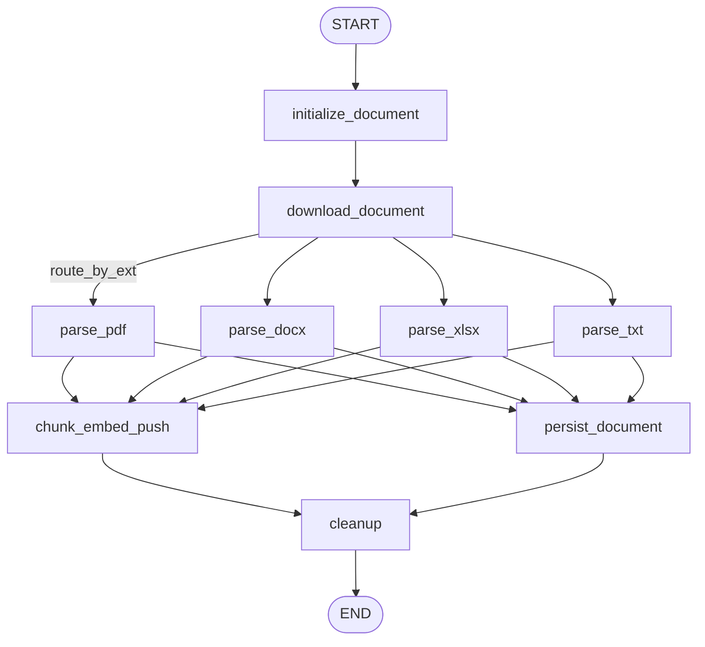
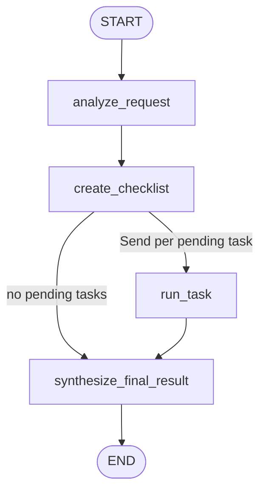
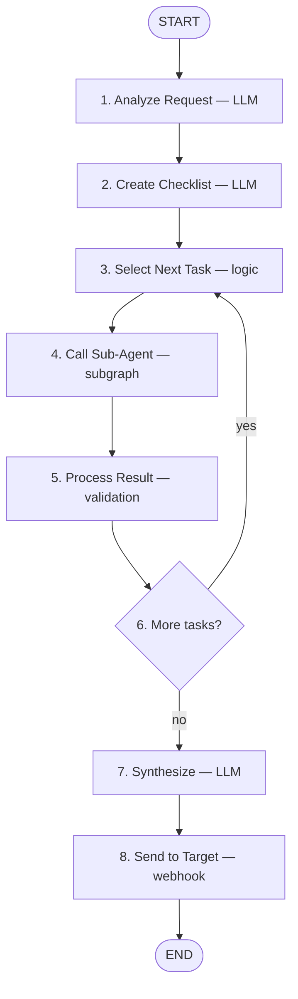

# Tender Agent

Document ingestion + retrieval intelligence for tender documents. Queue-driven LangGraph workers that turn tender PDFs/DOCX/XLSX into a hybrid-searchable knowledge base, then answer tender questions through specialized agents over that base.

<p align="left">
  
</p>

<p align="left">
  
  
  
  
  
  
</p>

---

## 📚 Table of Contents

- [What this project does](#-what-this-project-does)
- [Architecture](#-architecture)
- [Tech stack](#-tech-stack)
- [Repository layout](#-repository-layout)
- [Pipeline 1 — Ingestion](#-pipeline-1--ingestion)
- [Pipeline 2 — Intelligence](#-pipeline-2--intelligence)
- [Orchestrator — spec vs code](#-orchestrator--spec-vs-code)
- [Data model](#-data-model)
- [Vector store layout](#-vector-store-layout)
- [Message contracts](#-message-contracts)
- [Configuration](#-configuration)
- [Getting started](#-getting-started)
- [Deployment](#-deployment)
- [Current status](#-current-status)

---

## 🎯 What this project does

Two independent RabbitMQ workers, one shared codebase and Docker image.

| Worker | Queue | Job | Entry point |
|---|---|---|---|
| **Ingestion** | `agent:ingestion` | Download → parse → chunk → embed → index → persist | `worker/ingestion_worker.py` |
| **Intelligence** | `agent:intelligence` | Plan searches → hybrid retrieve → rerank → structured answer | `worker/intelligence_worker.py` |

Ingestion builds the knowledge base offline. Intelligence answers questions against it, filtered by tender `reference_no`.

---

## 🏗 Architecture

### Overall flow


The knowledge base (left, pink) is prepared offline by the ingestion worker: documents are chunked, embedded, and stored in Qdrant as dense + sparse vectors. At query time the orchestrator plans which specialized agents to run; each agent generates its own `(query, keywords)` pairs and delegates retrieval to one shared Search Sub-Agent.

### Orchestrator node workflow


Full node-by-node spec, state schema, prompts and I/O examples: [`docs/Orchestrator Agent — LangGraph Implementation Specification.md`](docs/Orchestrator%20Agent%20%E2%80%94%20LangGraph%20Implementation%20Specification.md).

> The diagram above shows the **spec's** serial checklist loop. The code fans the tasks out instead — see
> [Orchestrator — spec vs code](#-orchestrator--spec-vs-code).

### Layer responsibilities

```
ORCHESTRATOR        decides WHAT work needs doing, tracks the checklist
      ↓
SPECIALIZED AGENT   decides HOW to research one domain (documents, eligibility, …)
      ↓
SEARCH SUB-AGENT    performs retrieval (hybrid search + cross-encoder rerank)
      ↓
QDRANT              stores/serves the indexed chunks
```

---

## 🧰 Tech stack


| Layer | Choice | Notes |
|---|---|---|
| Language | Python 3.12 (`>=3.12,<3.13`) | pinned via `.python-version` |
| Packaging | `uv` | `uv.lock` committed, `package = false` |
| Orchestration | LangGraph 1.2 | one `StateGraph` per pipeline, `TypedDict` state |
| Checkpointing | `langgraph-checkpoint-postgres` | ingestion only, optional — falls back to no checkpointer |
| Queue | RabbitMQ via `pika` | durable queues, `prefetch_count=1`, manual ack/nack |
| Relational store | PostgreSQL via SQLModel + psycopg3 | Alembic migrations in `alembic/versions/` |
| Vector store | Qdrant | named vectors: `dense` (OpenAI) + `sparse` (BM25) |
| Parsing | Docling, pypdf, openpyxl | per-page markdown, tables preserved as pipe tables |
| Embeddings | `text-embedding-3-small` (1536d) + FastEmbed `Qdrant/bm25` | dense-only fallback if FastEmbed missing |
| Reranking | `sentence-transformers` CrossEncoder `ms-marco-MiniLM-L-6-v2` | CPU by default, env-configurable; torch pinned to the CPU wheel index |
| LLM | `gpt-4o-mini` via `langchain-openai` | structured output via Pydantic; one shared client, model from `CHAT_MODEL` |
| Observability | Langfuse | dependency present, **disabled by default** (`LANGFUSE_ENABLED`) |
| CI/CD | GitHub Actions → GHCR → self-hosted runner | `.github/workflows/deploy.yml` |

---

## 📁 Repository layout

```
tender-agent/
├── core/config.py              # pydantic-settings Settings, single source of env truth
├── database/
│   ├── models.py               # SQLModel tables: users, documents, document_pages
│   └── connection.py           # engine, session helpers, health check
├── vector/qdrant.py            # client + ensure_collection (schema migrate, payload indexes)
├── ingestion/
│   ├── graph.py                # ingestion StateGraph
│   ├── state.py                # IngestionState
│   └── nodes/                  # initialize → download → parse_* → chunk/persist → cleanup
├── intelligence/
│   ├── graph.py                # intelligence StateGraph
│   ├── state.py                # IntelligenceState
│   ├── llm.py                  # shared ChatOpenAI singleton (model from CHAT_MODEL)
│   ├── nodes/                  # analyze_request, create_checklist, run_task, synthesize_final_result
│   ├── subagents/search/       # shared Search Sub-Agent (hybrid_search → rerank)
│   └── subagents/specialized/  # per-domain agent (generate_queries → execute_search → synthesize)
├── worker/
│   ├── job.py                  # IngestionJob / IntelligenceJob payload validation
│   ├── ingestion_worker.py     # agent:ingestion consumer
│   └── intelligence_worker.py  # agent:intelligence consumer
├── scripts/view_graph.py       # print mermaid for intelligence + search graphs
├── alembic/                    # migrations
├── docs/                       # architecture diagrams + orchestrator spec
├── compose.yml                 # two services off one image
└── Dockerfile                  # uv multi-stage build
```

---

## 📥 Pipeline 1 — Ingestion

`worker/ingestion_worker.py` → `ingestion/graph.py`



**Node by node**

| Node | Does |
|---|---|
| `initialize_document` | Validates `job_id`/`file_url`/`reference_no`, mints `document_id` (uuid4), creates `TEMP_DIR/job_id/document_id/` |
| `download_document` | Google Drive (OAuth refresh-token, no key file, exports Google-native docs to PDF/XLSX/PPTX) or plain HTTPS streaming download; filename from `Content-Disposition` |
| `route_by_ext` | Conditional edge on file suffix → `.txt` / `.xlsx .xls .csv` / `.docx .doc` / everything else → PDF branch |
| `parse_pdf` / `parse_docx` / `parse_xlsx` / `parse_txt` | Docling convert (singleton converter), then **one** `export_to_markdown(page_break_placeholder=…)` split into pages — `export_to_markdown(page_no=i)` walks the whole item list per call, so the per-page loop survives only as a fallback when the split does not match the page count. Page-level failures are preserved, not fatal — status becomes `partial` |
| `chunk_embed_push` | Table-aware chunking (pipe tables stay intact, header repeated when a table exceeds `CHUNK_SIZE`; prose goes through `RecursiveCharacterTextSplitter`), OpenAI dense embeddings in batches with 3-attempt backoff, BM25 sparse via FastEmbed, upsert to Qdrant in batches of 128. Chunk IDs are `uuid5(document_id:page_no:chunk_idx)` — re-ingest overwrites instead of duplicating |
| `persist_document` | Idempotent upsert of `documents` + delete/reinsert of `document_pages`. Runs in parallel with `chunk_embed_push` |
| `cleanup` | Unlinks the downloaded file, guarded to stay inside `TEMP_DIR`; removes the working dir only if empty |

**Failure handling.** A failed graph run nacks the message with `requeue=False` (no infinite redelivery). `prefetch_count=1` keeps one document per worker in flight. RabbitMQ heartbeat is forced to 600s so long Docling conversions don't drop the connection.

**Checkpointing.** `PostgresSaver.from_conn_string(...)` with `thread_id = "{job_id}:{external_document_id or file_url}"` — one thread per file, no cross-file collision. If Postgres or the library is unavailable the worker logs a warning and runs without checkpoints.

---

## 🔎 Pipeline 2 — Intelligence

`intelligence/graph.py` + the shared Search Sub-Agent.



Every checklist task is independent — no task reads another's result — so `create_checklist` fans them
out with one `Send` per pending task instead of driving a `select → call → process → more?` loop. Depth
is a fixed 4 supersteps whatever the checklist length, and `max_concurrency` bounds the fan-out.

| Node | Does |
|---|---|
| `analyze_request` | Structured output → `{intent, reference_no, requirements[]}` |
| `create_checklist` | Structured output → tasks of `{task_id, agent, description}`, filtered to `AVAILABLE_AGENTS` |
| `run_task` | One checklist task end to end: invokes the specialized subgraph, writes the result envelope keyed by `task_id`, marks the checklist item. Reducers on `agent_results` / `checklist` / `errors` merge the parallel writes |
| `synthesize_final_result` | Combines the agent envelopes. Sees structured results only — `sources` is stripped, and each task's block is capped separately so one long result cannot truncate the next |
| `generate_queries` (specialized) | Per-agent `(query, keywords)` pairs. `company_document_finder` skips the LLM entirely: its checklist is fixed, so the pairs are the static list in `subagents/specialized/company_documents.py` |
| `execute_search` (specialized) | `search_graph.batch(...)` over the query pairs — dedup happens after retrieval, so nothing forces an order — then dedups by chunk id and caps at 21 |
| `hybrid_search` | Dense query embedding + BM25 sparse over `query + keywords`; Qdrant `query_points` with dual `Prefetch` (dense + sparse), filtered on `reference_no`, top 20. Falls back to dense-only if sparse is unavailable |
| `rerank` | CrossEncoder scores all hits in one batched `predict`; keeps score `> 0`, top 5. Weak-relevance fallback takes top 3 if nothing clears the threshold; on model failure falls back to Qdrant scores |

Print the live mermaid for both graphs:

```bash
uv run python scripts/view_graph.py
```

---

## 🧠 Orchestrator — spec vs code

The spec in `docs/` defines the layer above intelligence as a checklist-driven **loop**, no RAG of its own:



**What the code does differently.** Steps 3-6 are gone. Nothing in a task reads another task's result, so
the loop was pure serial latency: `create_checklist` now fans out one `Send` per pending task straight to
`run_task`, which is steps 4 and 5 in one node. See [Pipeline 2](#-pipeline-2--intelligence).

State: `user_query`, `reference_no`, `parsed_request`, `checklist`, `agent_results`, `errors`,
`final_response`. `checklist`, `agent_results` and `errors` carry reducers, because parallel tasks write
them at the same time. Checklist item statuses: `pending | running | success | failed | skipped`.

Specialized agents — `company_document_finder`, `reverse_auction`, `eligibility`, `important_dates`,
`financial_terms` — share one subgraph that generates its own `(query, keywords)` pairs and calls the
Search Sub-Agent. Every agent returns the same envelope (`task_id`, `agent`, `status`, `result`,
`sources`, `error`), so nothing above changes when an agent is added. Envelopes are keyed by `task_id`,
not by agent name — under fan-out, agent-name keys would let two tasks race and lose a result.

Design rule from the spec, now enforced in code: the final synthesis LLM sees structured agent results
only, never the raw Qdrant context again — `sources` is stripped before the prompt is built.

Step 8 (send to target / webhook) is still unimplemented.

---

## 🗄 Data model

`database/models.py`, migrations under `alembic/versions/`.

**`documents`** — one row per ingested file, unique on `document_id`.

`document_id` (uuid) · `external_document_id` · `job_id` · `reference_no` · `document_tag` · `document_name` · `original_url` · `file_url` · `file_path` · `status` · `error` · `total_pages` · `chunk_count` · timestamps

**`document_pages`** — one row per page, FK → `documents.document_id`.

`page_no` · `total_pages` · `markdown` · `text` · `status` · `error` · plus denormalized `reference_no` / `document_tag` / `job_id` for direct filtering

**`users`** — email/name/hashed_password/is_active. Present from the initial schema; not used by the workers.

---

## 🧭 Vector store layout

Collection: `QDRANT_COLLECTION` (default `tender_chunks`).

```
vectors:        { "dense": VectorParams(size=1536, distance=COSINE) }
sparse_vectors: { "sparse": SparseVectorParams() }   # BM25
point id:       uuid5(document_id:page_no:chunk_idx)
```

`ensure_collection()` is idempotent and self-migrating: it recreates the collection if it finds the legacy unnamed-vector schema or a dimension mismatch (**this drops existing points — reindex after an embedding-model change**), and creates keyword/integer payload indexes on every filterable field.

It is **memoized per process**. The check costs ~16 Qdrant round-trips (existence + 14 index creations that all no-op), and it used to run on every document *and every search* — roughly 800 wasted round-trips per tender. A schema change now needs a worker restart, which was already true of every other singleton in the process. A `get_collection` failure also propagates instead of being read as a schema verdict: a transient network error must never drop the collection and force a full re-embed.

Payload carries **both** snake_case and camelCase keys (`reference_no` *and* `referenceNo`, `page_no` *and* `pageNo`, …) so upstream services can filter with either convention. `null` values are stripped before upsert.

Payload fields: `text`, `page_no`, `chunk_idx`, `chunk_count`, `document_id`, `job_id`, `reference_no`, `document_tag` (also exposed as `document_type`), `document_name`, `original_url`, `total_pages`.

---

## 📨 Message contracts

Validation lives in `worker/job.py`. Field aliases accept snake_case and camelCase.

**`agent:ingestion`**

```json
{
  "jobId": "9f4c...",
  "referenceNo": "T123",
  "files": [
    {
      "fileName": "tender-notice.pdf",
      "fileType": "pdf",
      "fileUrl": "https://drive.google.com/file/d/<id>/view",
      "fileTag": "notice",
      "documentId": 4821
    }
  ]
}
```

`fileUrl` must start with `http://` or `https://`. `files` must be non-empty; each file becomes its own graph invocation.

**`agent:intelligence`**

```json
{ "referenceNo": "T123" }
```

Invalid payloads are nacked with `requeue=False` and logged with the full Pydantic error list.

---

## ⚙️ Configuration

Copy `.env.example` → `.env`. All settings resolve through `core/config.py` (`pydantic-settings`, case-insensitive, unknown keys ignored).

| Variable | Required | Default | Purpose |
|---|:---:|---|---|
| `DATABASE_URL` | ✅ | — | Postgres DSN. `postgres://` and `postgresql://` are auto-normalized to `postgresql+psycopg://` |
| `DB_ECHO` | | `false` | SQLAlchemy statement logging |
| `QDRANT_URL` | ✅ | — | Qdrant endpoint |
| `QDRANT_API_KEY` | ✅ | — | Rejected if blank |
| `RABBITMQ_URL` | ✅ | — | AMQP URL; heartbeat params appended automatically |
| `TEMP_DIR` | ✅ | — | Working directory for downloads/parsing; cleanup is confined to this path |
| `OPENAI_API_KEY` | ✅ | — | Embeddings + LLM. Ingestion fails fast without it |
| `EMBEDDING_MODEL` | | `text-embedding-3-small` | `text-embedding-3-large` → 3072 dims (forces collection recreate) |
| `EMBEDDING_BATCH_SIZE` | | `100` | Texts per embedding request |
| `QDRANT_COLLECTION` | | `tender_chunks` | Collection name |
| `CHUNK_SIZE` / `CHUNK_OVERLAP` | | `1000` / `200` | Splitter config |
| `CHAT_MODEL` | | `gpt-4o-mini` | LLM for every node. One knob — the shared client lives in `intelligence/llm.py` |
| `RERANK_MODEL` | | `cross-encoder/ms-marco-MiniLM-L-6-v2` | CrossEncoder model |
| `RERANK_DEVICE` | | `cpu` | Set `cuda` where a GPU exists |
| `LANGFUSE_ENABLED` | | `false` | Tracing off by default; `LANGFUSE_PUBLIC_KEY` / `SECRET_KEY` / `HOST` when enabled |
| `GOOGLE_OAUTH_CLIENT_ID` | Drive only | — | Desktop OAuth client |
| `GOOGLE_OAUTH_CLIENT_SECRET` | Drive only | — | |
| `GOOGLE_OAUTH_REFRESH_TOKEN` | Drive only | — | Generate offline with scope `https://www.googleapis.com/auth/drive.readonly` |
| `GOOGLE_OAUTH_TOKEN_URI` | | `https://oauth2.googleapis.com/token` | |

> Google Drive **folder** links are rejected — pass file links. Files must be shared with the OAuth account.

---

## 🚀 Getting started

### Prerequisites

Python 3.12, [uv](https://docs.astral.sh/uv/), and reachable PostgreSQL, RabbitMQ and Qdrant instances.

### Install

```bash
uv sync
cp .env.example .env      # then fill in real values
```

### Migrate

```bash
uv run alembic upgrade head
```

### Run the workers

```bash
uv run python -m worker.ingestion_worker      # consumes agent:ingestion
uv run python -m worker.intelligence_worker   # consumes agent:intelligence
```

Both declare their queue durably on startup, so order does not matter.

### Publish a test job

Publish the JSON shown under [Message contracts](#-message-contracts) directly to the `agent:ingestion` queue. The old `scripts/publish_job.py` helper built the pre-multi-file `IngestionJob` and no longer validated, so it was removed.

### Inspect the graphs

```bash
uv run python scripts/view_graph.py
```

---

## 📦 Deployment

Single image, two services (`compose.yml`):

```bash
docker compose pull ingestion-agent intelligence-agent
docker compose up -d
```

Both services read `.env.production` and join the external `infra` network. Postgres, Qdrant and RabbitMQ are external — no `depends_on`. Both mount the shared `model-cache` volume at `/models` (`HF_HOME`, `TORCH_HOME`), so the CrossEncoder, FastEmbed BM25 and docling weights are downloaded once instead of on every container start.

CI (`.github/workflows/deploy.yml`) on push to `main`:

1. Build the multi-stage `uv` image with GitHub Actions cache.
2. Push to `ghcr.io/<owner>/tender-agent` tagged `latest` and the short SHA.
3. On the self-hosted Windows runner: sync `compose.yml` to `D:/tender-agent/`, `docker compose pull` + `up -d`, then prune all but the two most recent images.

The runtime image installs `libgl1`, `libglib2.0-0`, `libsm6`, `libxext6`, `libxrender1`, `libgomp1` for Docling/OpenCV. torch and torchvision are pinned to the PyTorch CPU index in `pyproject.toml` — `RERANK_DEVICE` is `cpu` and nothing here touches a GPU, so the default wheels' CUDA stack (`nvidia-cublas`, `cudnn`, `nccl`, `triton`, …) is several GB of image for code that never runs. Point `[tool.uv.sources]` at a `cuXXX` index if a GPU host appears.

---

## ✅ Current status

| Area | State |
|---|---|
| Ingestion pipeline | ✅ Complete end to end — download, parse, chunk, embed, index, persist, cleanup |
| Search Sub-Agent | ✅ Hybrid search + cross-encoder rerank, `reference_no` filtering |
| Orchestrator graph | ✅ `analyze_request → create_checklist → run_task (fanned out) → synthesize_final_result` |
| Specialized agents | ✅ One subgraph, driven per agent by `AGENT_PROMPTS` / `SYNTHESIS_PROMPT`. `company_document_finder` uses a static query checklist |
| Intelligence worker | ⚠️ **Stub** — validates the payload and acks; does not invoke `build_intelligence_graph()` yet |
| Intelligence job payload | ⚠️ `IntelligenceJob` carries only `reference_no`, but `analyze_request` requires `user_query` — an empty `parsed_request` yields an empty checklist and no output |
| Webhook / target delivery | ⛔ Not implemented |
| Langfuse tracing | ⚠️ Wired into `download_document` only, disabled by default |
| Tests | ⚠️ Four `test_*.py` self-checks at the repo root (`python test_<name>.py`), no suite |

**Next steps, in dependency order:** decide where `user_query` comes from → wire the intelligence graph into its worker → add the webhook node.
