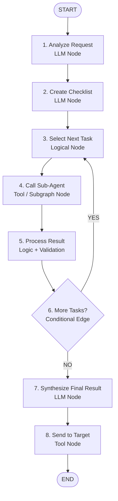
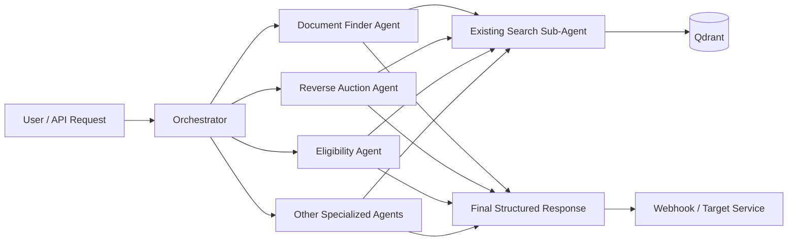
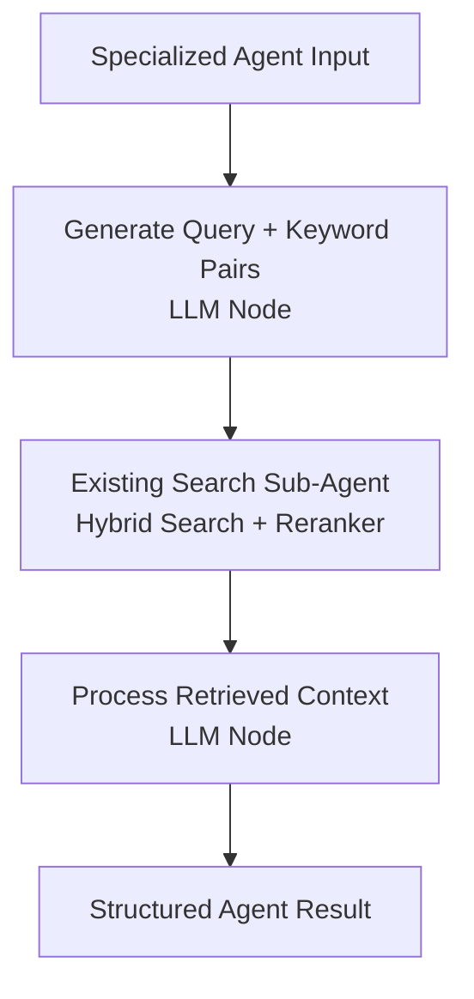
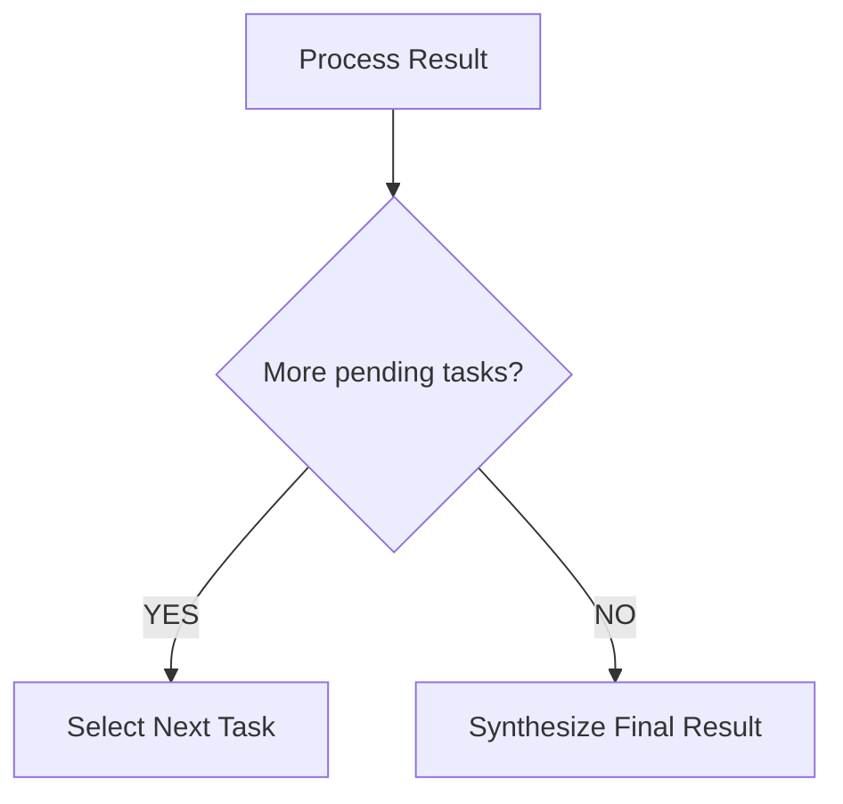
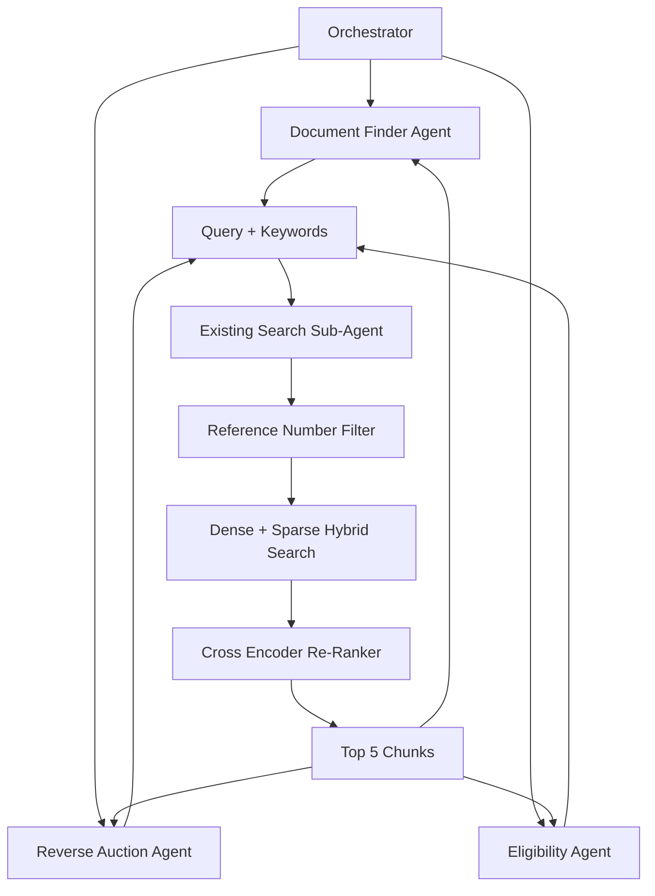

# Orchestrator Agent — LangGraph Implementation Specification

## 1. Purpose

The Orchestrator Agent is responsible for:

1. Understanding the incoming request.
2. Determining which specialized agents are required.
3. Creating a checklist of tasks.
4. Selecting the next pending task.
5. Calling the appropriate specialized agent.
6. Processing and storing the agent's result.
7. Updating the checklist.
8. Repeating until all required tasks are completed.
9. Synthesizing all specialized-agent results into one final response.
10. Sending the final structured response to the target service through a webhook/API.

The orchestrator **does not perform RAG itself**.

The specialized agents perform domain-specific reasoning and use the existing Search Sub-Agent for retrieval.

---

# 2. Overall Graph



---

# 3. High-Level Architecture



---

# 4. Important Mental Model

The orchestrator should be treated as a **workflow manager**.

```text
                ORCHESTRATOR

                     │
                     ▼
             Understand Request
                     │
                     ▼
              Create Checklist
                     │
                     ▼
             Pick Pending Task
                     │
                     ▼
              Call Sub-Agent
                     │
                     ▼
              Store Result
                     │
                     ▼
              Mark Task Done
                     │
                     ▼
               More Tasks?
                /        \
              YES         NO
               │           │
               │           ▼
               │      Final Synthesis
               │           │
               └───────────┘
                           │
                           ▼
                       Webhook
```

The **checklist is the central control mechanism**.

---

# 5. LangGraph State

The orchestrator should maintain a shared state.

A starting version can look like:

```python
class OrchestratorState(TypedDict):

    # Original request
    user_query: str
    reference_number: str

    # Parsed understanding of request
    parsed_request: dict

    # Tasks that need to be completed
    checklist: list[dict]

    # Currently selected task
    current_task: dict | None

    # Results returned by specialized agents
    agent_results: dict

    # Errors encountered during execution
    errors: list[dict]

    # Final response
    final_response: dict
```

---

# 6. State Fields

## `user_query`

Original user request.

Example:

```text
What documents are required for tender T123 and what are the reverse auction clauses?
```

Type:

```python
str
```

---

## `reference_number`

Tender/reference number used by specialized agents and ultimately by the Search Sub-Agent for filtering.

Example:

```text
T123
```

Type:

```python
str
```

---

## `parsed_request`

Structured interpretation of the user request.

Example:

```json
{
  "intent": "tender_information",
  "requirements": [
    "required_documents",
    "reverse_auction_clauses"
  ]
}
```

---

## `checklist`

The orchestrator's complete work plan.

Example:

```json
[
  {
    "task_id": "document_requirements",
    "agent": "document_finder",
    "description": "Find all documents required for the tender",
    "status": "pending"
  },
  {
    "task_id": "reverse_auction",
    "agent": "reverse_auction",
    "description": "Find all reverse auction clauses",
    "status": "pending"
  }
]
```

Possible statuses:

```text
pending
running
success
failed
skipped
```

---

## `current_task`

The task currently being executed.

Example:

```json
{
  "task_id": "document_requirements",
  "agent": "document_finder",
  "description": "Find all documents required for the tender",
  "status": "running"
}
```

---

## `agent_results`

Stores the structured result from every completed specialized agent.

Example:

```json
{
  "document_finder": {
    "status": "success",
    "result": {
      "documents": [
        "Technical Specification",
        "Price Schedule",
        "EMD Document"
      ]
    }
  },

  "reverse_auction": {
    "status": "success",
    "result": {
      "applicable": true,
      "clauses": [
        "..."
      ]
    }
  }
}
```

---

# 7. Node 1 — Analyze Request

## Node Type

**LLM Node**

---

## Purpose

Understand the user's request and convert the unstructured request into a structured representation that the rest of the graph can use.

This node should **not perform retrieval**.

It should answer:

- What does the user want?
- What is the reference/tender number?
- What information is being requested?
- Are there explicit constraints?
- What is the overall intent?

---

## Input

From `OrchestratorState`:

```python
{
    "user_query": str,
    "reference_number": str
}
```

Example:

```json
{
  "user_query": "Tell me which documents are required for tender T123 and whether reverse auction is applicable.",
  "reference_number": "T123"
}
```

---

## Output

Updates:

```python
parsed_request
```

Example:

```json
{
  "intent": "tender_requirements",
  "reference_number": "T123",
  "requirements": [
    {
      "type": "required_documents",
      "description": "Identify documents required for the tender"
    },
    {
      "type": "reverse_auction",
      "description": "Determine whether reverse auction is applicable and identify related clauses"
    }
  ]
}
```

---

## Example System Prompt

```text
You are the request analysis component of a tender research system.

Your job is to understand the user's request and convert it into a structured representation.

Extract:
1. The user's main intent.
2. The tender/reference number.
3. The specific information the user is requesting.
4. Any explicit constraints.

Do not perform document retrieval.
Do not answer the user's question.
Do not invent information.

Return only the required structured output.
```

---

## Next Node

```text
Analyze Request
      ↓
Create Checklist
```

---

# 8. Node 2 — Create Checklist

## Node Type

**LLM Node**

---

## Purpose

Convert the parsed request into a list of concrete tasks.

This is where the orchestrator determines:

> "Which specialized agents do I need to call?"

For example:

```text
User asks:
"Which documents are required and what are the reverse auction clauses?"

             ↓

Checklist:

1. Document Finder Agent
2. Reverse Auction Agent
```

---

## Input

From state:

```python
{
    "parsed_request": dict,
    "reference_number": str
}
```

Example:

```json
{
  "parsed_request": {
    "intent": "tender_requirements",
    "requirements": [
      {
        "type": "required_documents",
        "description": "Identify documents required for the tender"
      },
      {
        "type": "reverse_auction",
        "description": "Determine whether reverse auction is applicable"
      }
    ]
  },
  "reference_number": "T123"
}
```

---

## Output

Updates:

```python
checklist
```

Example:

```json
[
  {
    "task_id": "document_requirements",
    "agent": "document_finder",
    "description": "Find all documents required for tender T123",
    "status": "pending"
  },
  {
    "task_id": "reverse_auction",
    "agent": "reverse_auction",
    "description": "Find all reverse auction clauses applicable to tender T123",
    "status": "pending"
  }
]
```

---

## Checklist Item Schema

A good starting schema:

```python
class ChecklistItem(TypedDict):
    task_id: str
    agent: str
    description: str
    status: Literal[
        "pending",
        "running",
        "success",
        "failed",
        "skipped"
    ]
    result_key: str | None
    error: str | None
```

---

## Example System Prompt

```text
You are the planning component of a multi-agent tender research system.

Based on the parsed user request, create a checklist of research tasks.

For every task:
- Select the appropriate specialized agent.
- Clearly describe what that agent must find.
- Give every task a unique task_id.
- Initially mark every task as pending.

Only select agents that are necessary to answer the user's request.

Available agents:
- document_finder
- reverse_auction
- eligibility
- important_dates
- financial_terms

Do not perform the research yourself.
Do not generate answers.
Only create the execution checklist.
```

---

## Next Node

```text
Create Checklist
      ↓
Select Next Task
```

---

# 9. Node 3 — Select Next Task

## Node Type

**Logical Node**

This should preferably be normal Python logic rather than an LLM.

---

## Purpose

Find the next task that has:

```text
status == "pending"
```

The orchestrator should not waste an LLM call deciding something deterministic.

---

## Input

```python
{
    "checklist": list[ChecklistItem]
}
```

Example:

```json
[
  {
    "task_id": "document_requirements",
    "agent": "document_finder",
    "status": "success"
  },
  {
    "task_id": "reverse_auction",
    "agent": "reverse_auction",
    "status": "pending"
  },
  {
    "task_id": "eligibility",
    "agent": "eligibility",
    "status": "pending"
  }
]
```

---

## Logic

Pseudo-code:

```python
def select_next_task(state):

    for task in state["checklist"]:

        if task["status"] == "pending":

            task["status"] = "running"

            return {
                "current_task": task,
                "checklist": state["checklist"]
            }

    return {
        "current_task": None
    }
```

---

## Output

If a task exists:

```json
{
  "current_task": {
    "task_id": "reverse_auction",
    "agent": "reverse_auction",
    "description": "Find all reverse auction clauses",
    "status": "running"
  }
}
```

If no task exists:

```json
{
  "current_task": null
}
```

---

## Next Node

Normally:

```text
Select Next Task
      ↓
Call Sub-Agent
```

The graph should only reach this node when there are pending tasks.

---

# 10. Node 4 — Call Sub-Agent

## Node Type

**Tool Node / Subgraph Invocation**

---

## Purpose

Invoke the specialized agent specified by:

```python
current_task["agent"]
```

For example:

```text
current_task.agent = "document_finder"

                ↓

Document Finder Agent
```

or:

```text
current_task.agent = "reverse_auction"

                ↓

Reverse Auction Agent
```

---

# 11. Specialized Agent Architecture

Each specialized agent should ideally be its own LangGraph subgraph.

For example:



So your existing Search Sub-Agent becomes a **shared retrieval component**.

---

# 12. Input to Specialized Agent

The orchestrator should pass enough information for the specialized agent to perform its task.

Recommended input:

```python
{
    "reference_number": str,
    "user_query": str,
    "parsed_request": dict,
    "task": ChecklistItem
}
```

Example:

```json
{
  "reference_number": "T123",

  "user_query": "Which documents are required for tender T123?",

  "parsed_request": {
    "intent": "tender_requirements"
  },

  "task": {
    "task_id": "document_requirements",
    "agent": "document_finder",
    "description": "Find all documents required for tender T123"
  }
}
```

---

# 13. Specialized Agent Output

Every specialized agent should return a predictable envelope.

Example:

```json
{
  "task_id": "document_requirements",

  "agent": "document_finder",

  "status": "success",

  "result": {
    "documents": [
      {
        "name": "Technical Specification",
        "required": true,
        "evidence": "..."
      },
      {
        "name": "Price Schedule",
        "required": true,
        "evidence": "..."
      }
    ]
  },

  "sources": [
    {
      "chunk_id": "abc123"
    }
  ],

  "error": null
}
```

The **domain-specific `result` schema can differ between agents**, but the outer envelope should remain consistent.

---

## Next Node

```text
Call Sub-Agent
      ↓
Process Result
```

---

# 14. Node 5 — Process Result

## Node Type

**Logic Node + Validation**

An LLM can optionally be added later if result interpretation is required, but the initial implementation should keep this deterministic.

---

## Purpose

This node:

1. Receives the specialized agent response.
2. Validates the response.
3. Stores the result.
4. Updates the corresponding checklist item.
5. Records errors if the agent failed.

---

## Input

```python
{
    "current_task": ChecklistItem,
    "agent_result": dict,
    "checklist": list[ChecklistItem],
    "agent_results": dict
}
```

---

## Successful Input Example

```json
{
  "current_task": {
    "task_id": "document_requirements",
    "agent": "document_finder",
    "status": "running"
  },

  "agent_result": {
    "task_id": "document_requirements",
    "agent": "document_finder",
    "status": "success",
    "result": {
      "documents": [
        "Technical Specification",
        "Price Schedule"
      ]
    }
  }
}
```

---

## Logic

Conceptually:

```python
def process_result(state):

    task = state["current_task"]
    result = state["agent_result"]

    # Validate result
    validate(result)

    # Store result
    state["agent_results"][task["agent"]] = result

    # Update checklist
    for item in state["checklist"]:
        if item["task_id"] == task["task_id"]:

            if result["status"] == "success":
                item["status"] = "success"
            else:
                item["status"] = "failed"

    return state
```

---

## Output

Updated:

```python
{
    "checklist": [...],
    "agent_results": {...},
    "errors": [...]
}
```

Example:

```json
{
  "checklist": [
    {
      "task_id": "document_requirements",
      "agent": "document_finder",
      "status": "success"
    },
    {
      "task_id": "reverse_auction",
      "agent": "reverse_auction",
      "status": "pending"
    }
  ],

  "agent_results": {
    "document_finder": {
      "status": "success",
      "result": {
        "documents": [
          "Technical Specification",
          "Price Schedule"
        ]
      }
    }
  }
}
```

---

## Error Handling

If the specialized agent fails:

```text
Specialized Agent
       ↓
    FAILED
       ↓
Process Result
       ↓
Mark task = failed
       ↓
Continue / retry / terminate
```

Initially, I recommend keeping this simple:

```text
success → mark success

failure → mark failed
```

Later we can add:

```text
retry_count
fallback_agent
partial_success
```

---

## Next Node

```text
Process Result
      ↓
More Tasks?
```

---

# 15. Node 6 — More Tasks?

## Node Type

**Conditional Edge**

This is graph routing logic.

It does not need an LLM.

---

## Purpose

Determine whether any checklist item is still pending.

---

## Input

```python
checklist
```

Example:

```json
[
  {
    "task_id": "documents",
    "status": "success"
  },
  {
    "task_id": "reverse_auction",
    "status": "pending"
  }
]
```

---

## Logic

```python
def more_tasks(state):

    for task in state["checklist"]:

        if task["status"] == "pending":
            return "continue"

    return "complete"
```

---

## Output

Two possible routes:

```text
"continue"
```

or

```text
"complete"
```

---

## Graph Routing



---

## Next Node

### If tasks remain:

```text
More Tasks?
     ↓ YES
Select Next Task
```

### If all tasks are complete:

```text
More Tasks?
     ↓ NO
Synthesize Final Result
```

---

# 16. Node 7 — Synthesize Final Result

## Node Type

**LLM Node**

---

## Purpose

Combine all specialized-agent results into one final structured response.

This is the **final reasoning/assembly step**.

It should not perform new retrieval.

It should work only with the results already collected.

---

## Input

Recommended input:

```python
{
    "user_query": str,
    "reference_number": str,
    "parsed_request": dict,
    "checklist": list[ChecklistItem],
    "agent_results": dict
}
```

Example:

```json
{
  "reference_number": "T123",

  "agent_results": {
    "document_finder": {
      "status": "success",
      "result": {
        "documents": [
          "Technical Specification",
          "Price Schedule"
        ]
      }
    },

    "reverse_auction": {
      "status": "success",
      "result": {
        "applicable": true,
        "clauses": [
          "Reverse auction will be conducted..."
        ]
      }
    },

    "eligibility": {
      "status": "success",
      "result": {
        "criteria": [
          "..."
        ]
      }
    }
  }
}
```

---

## Output

Updates:

```python
final_response
```

Example:

```json
{
  "tender_id": "T123",

  "required_documents": [
    {
      "name": "Technical Specification",
      "required": true
    },
    {
      "name": "Price Schedule",
      "required": true
    }
  ],

  "reverse_auction": {
    "applicable": true,
    "clauses": [
      "..."
    ]
  },

  "eligibility": {
    "criteria": [
      "..."
    ]
  }
}
```

---

## Example System Prompt

```text
You are the final synthesis component of a tender research system.

You have received structured results from multiple specialized research agents.

Your job is to combine those results into one final structured response.

Rules:
- Use only the information provided by the agent results.
- Do not perform new research.
- Do not invent missing information.
- Preserve important evidence and details.
- Remove duplicate information.
- Clearly separate information belonging to different sections.
- If agents disagree, preserve the conflict or identify the discrepancy rather than inventing a resolution.
- Follow the required output schema exactly.
```

---

## Important Principle

The final LLM should **not receive the entire raw Qdrant context again** unless there is a specific reason.

Prefer:

```text
Qdrant
   ↓
Search Sub-Agent
   ↓
Specialized Agent
   ↓
Structured Result
   ↓
Orchestrator
   ↓
Final Synthesis
```

rather than:

```text
Qdrant
   ↓
huge raw context
   ↓
Final LLM
```

This keeps the final synthesis focused.

---

# 17. Node 8 — Send to Target

## Node Type

**Tool Node**

---

## Purpose

Send the final structured response to the external service that requires the result.

---

## Input

```python
{
    "reference_number": str,
    "final_response": dict
}
```

Example:

```json
{
  "reference_number": "T123",
  "final_response": {
    "tender_id": "T123",
    "required_documents": [
      "Technical Specification",
      "Price Schedule"
    ],
    "reverse_auction": {
      "applicable": true
    }
  }
}
```

---

## Action

Perform an HTTP request:

```text
POST /target-endpoint
```

with the required payload.

---

## Output

Recommended:

```json
{
  "status": "success",
  "response_code": 200,
  "response_id": "abc123"
}
```

Or on failure:

```json
{
  "status": "failed",
  "response_code": 500,
  "error": "Target service unavailable"
}
```

---

## Next Node

```text
Send to Target
      ↓
     END
```

---

# 18. Complete Node Table

| # | Node | Type | Input | Output | Next |
|---|---|---|---|---|---|
| 1 | Analyze Request | LLM | `user_query`, `reference_number` | `parsed_request` | Create Checklist |
| 2 | Create Checklist | LLM | `parsed_request`, `reference_number` | `checklist` | Select Next Task |
| 3 | Select Next Task | Logic | `checklist` | `current_task` | Call Sub-Agent |
| 4 | Call Sub-Agent | Tool/Subgraph | `current_task`, request context | `agent_result` | Process Result |
| 5 | Process Result | Logic/Validation | `agent_result`, `current_task` | Updated checklist + `agent_results` | More Tasks? |
| 6 | More Tasks? | Conditional Edge | `checklist` | `continue` / `complete` | Select Next Task / Synthesize |
| 7 | Synthesize Final Result | LLM | `agent_results` + request | `final_response` | Send to Target |
| 8 | Send to Target | Tool | `final_response` | webhook status | END |

---

# 19. Complete Execution Example

Suppose the user asks:

```text
For tender T123, tell me which documents are required,
whether reverse auction is applicable, and the eligibility criteria.
```

### Step 1 — Analyze

```text
parsed_request
```

becomes:

```json
{
  "requirements": [
    "required_documents",
    "reverse_auction",
    "eligibility"
  ]
}
```

---

### Step 2 — Create Checklist

```text
┌────────────────────────────┐
│ document_finder             │ → pending
├────────────────────────────┤
│ reverse_auction             │ → pending
├────────────────────────────┤
│ eligibility                 │ → pending
└────────────────────────────┘
```

---

### Step 3 — Select

```text
document_finder → running
```

---

### Step 4 — Call

```text
Document Finder Agent
        ↓
Query + Keyword generation
        ↓
Search Sub-Agent
        ↓
Qdrant hybrid search
        ↓
Cross Encoder
        ↓
Top 5 chunks
        ↓
Document Finder reasoning
        ↓
Structured result
```

---

### Step 5 — Process

```text
document_finder → success
```

Checklist becomes:

```text
document_finder → success
reverse_auction → pending
eligibility     → pending
```

---

### Step 6 — More Tasks?

Yes.

Go back to:

```text
Select Next Task
```

---

### Step 7 — Reverse Auction

Same process:

```text
reverse_auction → running
                    ↓
                Search Agent
                    ↓
             structured result
                    ↓
             reverse_auction → success
```

---

### Step 8 — Eligibility

Same process:

```text
eligibility → running
                  ↓
             Search Agent
                  ↓
          structured result
                  ↓
          eligibility → success
```

---

### Step 9 — More Tasks?

```text
document_finder → success
reverse_auction → success
eligibility     → success

          ↓

No pending tasks
```

Route to:

```text
Synthesize Final Result
```

---

### Step 10 — Synthesis

```text
document_finder result
        +
reverse_auction result
        +
eligibility result
        ↓
   Final LLM
        ↓
final_response
```

---

### Step 11 — Webhook

```text
final_response
      ↓
POST /target-service
      ↓
    END
```

---

# 20. Recommended Initial LangGraph Structure

Conceptually, your graph code should look like:

```python
graph.add_node("analyze_request", analyze_request)

graph.add_node("create_checklist", create_checklist)

graph.add_node("select_next_task", select_next_task)

graph.add_node("call_sub_agent", call_sub_agent)

graph.add_node("process_result", process_result)

graph.add_node("synthesize_final_result", synthesize_final_result)

graph.add_node("send_to_target", send_to_target)


graph.add_edge(START, "analyze_request")

graph.add_edge(
    "analyze_request",
    "create_checklist"
)

graph.add_edge(
    "create_checklist",
    "select_next_task"
)

graph.add_edge(
    "select_next_task",
    "call_sub_agent"
)

graph.add_edge(
    "call_sub_agent",
    "process_result"
)

graph.add_conditional_edges(
    "process_result",
    more_tasks,
    {
        "continue": "select_next_task",
        "complete": "synthesize_final_result",
    }
)

graph.add_edge(
    "synthesize_final_result",
    "send_to_target"
)

graph.add_edge(
    "send_to_target",
    END
)
```

---

# 21. Where Your Existing Search Agent Fits

Your existing component should remain separate.



The important distinction is:

```text
ORCHESTRATOR
    │
    │ decides WHAT work needs to be done
    ↓
SPECIALIZED AGENT
    │
    │ decides HOW to research its domain
    ↓
SEARCH SUB-AGENT
    │
    │ performs retrieval
    ↓
QDRANT
```

---

# 22. Final Mental Model

Think of the three layers as having completely different responsibilities.

```text
┌─────────────────────────────────────────────┐
│              ORCHESTRATOR                   │
│                                             │
│ "What needs to be researched?"              │
│ "Which agents should do it?"                │
│ "What is completed?"                        │
│ "What remains?"                             │
│ "When is the entire job finished?"          │
└──────────────────────┬──────────────────────┘
                       │
              delegates tasks
                       ↓
┌─────────────────────────────────────────────┐
│          SPECIALIZED AGENTS                 │
│                                             │
│ Document Finder                             │
│ Reverse Auction                             │
│ Eligibility                                 │
│ Important Dates                             │
│ Financial Terms                             │
│                                             │
│ "How do I answer my specific responsibility?"│
└──────────────────────┬──────────────────────┘
                       │
                 requests context
                       ↓
┌─────────────────────────────────────────────┐
│            SEARCH SUB-AGENT                 │
│                                             │
│ Dense search                                │
│ Sparse/keyword search                       │
│ Reference-number filtering                  │
│ Hybrid retrieval                            │
│ Cross-encoder reranking                     │
│ Top 5 chunks                                │
└──────────────────────┬──────────────────────┘
                       │
                       ↓
                    QDRANT
```

This separation is the core architecture:

**Orchestrator = manages work**  
**Specialized Agent = solves one domain problem**  
**Search Sub-Agent = retrieves evidence**  
**Qdrant = stores/retrieves knowledge**

The first implementation should therefore focus on getting the **orchestrator state + checklist + loop** correct; once that works, each specialized agent can be plugged into the same interface without changing the orchestrator.